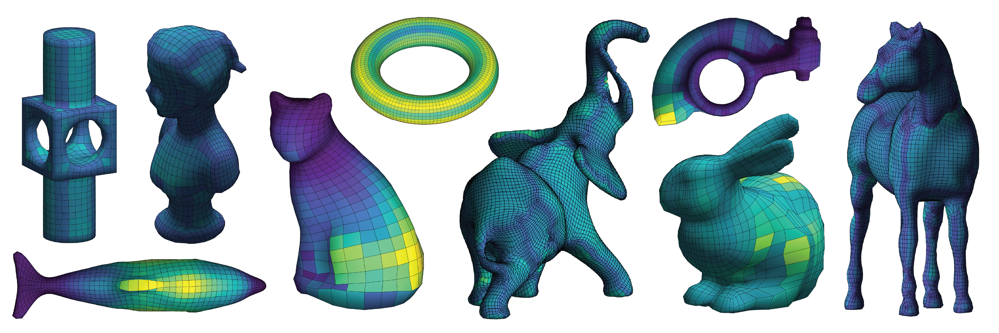

# SOS-hex: Hexehedral Quality and Repair with Sum-of-Squares

Source code for the paper ["Hexahedral Mesh Repair via SOS Relaxation"](http://people.csail.mit.edu/jsolomon/assets/sos_hex.pdf) by Zoë Marschner, David Palmer, Paul Zhang, and Justin Solomon from Symposium on Geometry Processing 2020.

> 1. [Installation](#installation)
>  * [Dependencies](#dependencies)
> 2. [Examples](#examples)
>  * [Validity of a Single Hex](#validity-of-a-single-hex)
>  * [Validity of a Mesh from a .vtk File](#validity-of-a-mesh-from-a-vtk-file)
>  * [Validity of Subset Mesh Hexes](#validity-of-subset-mesh-hexes)
>  * [Repairing a Mesh](#repairing-a-mesh)
> 3. [Credits](#credits)

## Installation
Clone this repository and then run the following commands in matlab
```
addpath(genpath(<SOS-hex>))
savepath
```
where `SOS-hex` is the path to the root of this repository.
### Dependencies
This code uses the library **Yalmip**, which can be downloaded [here](https://yalmip.github.io/download/) and the solver **Mosek**, which can be downloaded [here](https://www.mosek.com/downloads/).

## Examples
The following examples show different ways to compute the minimum Jacobian determinants and to repair meshes. Most functions also include many optional arguments, which are described in the header comments of each file. Some important ones to be aware of:
- many of the functions that use SOS accept an optional argument `verbose` which allows additional debug info to be printed.
- `SOS_jacobian_single_hex` and `SOS_jacobian_batch_model` both take an optional argument k, which defines the order of the relaxation to be used.

Additionally, note that all of the functions that calculate the minimum Jacobian determinant also calculate the location at which this value occurs and the second eigenvalue of the moment matrix, a measure of the quality of the relaxation.

### Validity of a Single Hex
The following code will, for a single hex, calculate the minimum Jacobian determinant and the point at which this minimum, as well as the second eigenvalue of the moment matrix, which can be used to verify exact recovery. Note that calculating these values for more than one hex is much more efficient with the method described in [Validity of Subset Mesh Hexes](#validity-of-subset-mesh-hexes).
```
V = rand_hex;
[res, argmin, second_eigenvalue] = SOS_jacobian_single_hex(V)
plot_hex_surface(V);
``` 

### Validity of a Mesh from a .vtk File
This example demonstrates calculating the minimum Jacobian determinant and location at which this point occurs for every hex in a .vtk file, and plots the mesh, colored by the values for the Jacobian.
```
bunny = load_vtk('<SOS-hex>/bunny.vtk');
bunny = calc_mesh_jacobians(bunny);
jacobians = bunny.jacobians(:,1)
argmins = bunny.jacobians(:, 2:4)
plot_mesh(bunny);
``` 

### Validity of Subset of Mesh Hexes
This example shows how the minimum Jacobian determinants and argmins can be calculated for many hexes at once. In this example, these are the first 10 hexes of a .vtk file, but any vector of hexes will work, e.g. the result of rand_hexes(N). 
```
bunny = load_vtk('<SOS-hex>/bunny.vtk');
first_ten = get_hexes(bunny, 1:10);
[jacobians, argmins] = calc_batch_jacobians(first_ten)
```

### Repairing a Mesh
The following example repairs a mesh loaded from a .vtk so that it no longer has any invalid hexes and then saves the result to a new file.
```
bunny = load_vtk('<SOS-hex>/bunny.vtk');
repaired_bunny = repair_mesh(bunny)
save_vtk(repaired_bunny, '<SOS-hex>/repaired_bunny.vtk')
```

## Credits
The file `bunny.vtk` is included for testing purposes and is from "Dual sheet meshing: An interactive approach to robust hexahedralization" by Takayama, K. published in _Computer Graphics Forum 38_ (2019), accessed via [hexalab.net](hexalab.net).
